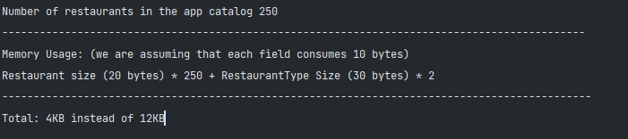

# Laboratory work nr 2, TMPS
## Creational Design Patterns

---

## Theory
In software engineering, creational design patterns are design patterns that deal with object creation mechanisms,
trying to create objects in a manner suitable to the situation. The basic form of object creation could result in design
problems or added complexity to the design. Creational design patterns solve this problem by somehow controlling this
object creation.

## Implementation description
### Adapter Design Pattern
* Convert the interface of a class into another interface clients expect. Adapter lets classes work together that couldn't 
otherwise because of incompatible interfaces.
* Wrap an existing class with a new interface.
* Impedance match an old component to a new system
The implementation itself:
```
public class Pizza implements Price{

    @Override
    public double getPrice(){
        return 20.99;
    }
}

public interface Price {
    double getPrice();
}

public interface PriceAdapter {
    double getPrice();
}

public class PriceAdapterImpl implements PriceAdapter{
    private final Price priceInEuroCurrency;

    public PriceAdapterImpl(Price priceInEuroCurrency) {
        this.priceInEuroCurrency = priceInEuroCurrency;
    }

    @Override
    public double getPrice() {
        return convertEuroToDollar(priceInEuroCurrency.getPrice());
    }

    private double convertEuroToDollar(double euro){
        return euro * 0.97;
    }
}
```


So, here in the implementation of the project we have a delivery app, and we used an adapter to convert currency of price, so when the user 
want to see price in dollars instead of euro, was used an adapter to convert this currency. and get the price.

### Bridge Design Pattern
* Decouple an abstraction from its implementation so that the two can vary independently.
* Publish interface in an inheritance hierarchy, and bury implementation in its own inheritance hierarchy.
* Beyond encapsulation, to insulation

The implementation itself:
```
//first hierarchy
public abstract class Pizza {
    protected String sauce;
    protected String toppings;
    protected String crust;

    public abstract void assemble();

    public void setSauce(String sauce) {
        this.sauce = sauce;
    }

    public void setToppings(String toppings) {
        this.toppings = toppings;
    }

    public void setCrust(String crust) {
        this.crust = crust;
    }
}

//second hierarchy
public abstract class  Restaurant {

    protected Pizza pizza;

    protected Restaurant(Pizza pizza) {
        this.pizza = pizza;
    }

    abstract void addSauce();
    abstract void addToppings();
    abstract void makeCrust();

    public void deliver() {
        addSauce();
        addToppings();
        makeCrust();
        pizza.assemble();
        System.out.println("Order in Progress!");
    }
}
```
Also, in a delivery app we have different type of restaurant and different type of products or foods, so if we want to order 
some kind of food present in different restaurant we will need bridge pattern which will map our two hierarchies, the restaurant and pizza.

### Composite Design Pattern
* Compose objects into tree structures to represent whole-part hierarchies. Composite lets clients treat individual objects and compositions of objects uniformly.
* Recursive composition
* "Directories contain entries, each of which could be a directory."
* 1-to-many "has a" up the "is a" hierarchy

The implementation itself:
```
public interface Order {

    double calculatePrice();
}

public abstract class Food implements Order {

    protected final String foodName;
    protected final double price;

    protected Food(String foodName, double price) {
        this.foodName = foodName;
        this.price = price;
    }

    public String getFoodName() {
        return foodName;
    }

    public double getPrice() {
        return price;
    }
}

public class CompositeOrder implements Order {

    private final List<Order> foods = new ArrayList<>();

    public CompositeOrder(Order... products){
        foods.addAll(Arrays.asList(products));
    }

    @Override
    public double calculatePrice() {
        return foods.stream().mapToDouble(Order::calculatePrice).sum();
    }
}
```
The composite design pattern is used in project for complex orders, when an order is compose of combos and some other foods
where the combo means a combinations of foods, so when we need to calculate the price of this complex orders we will use the composite 
design pattern. Shortly it was created an order hierarchy, and it was used to calculate the price of a composite order.

### Facade Design Pattern
* Provide a unified interface to a set of interfaces in a subsystem. Facade defines a higher-level interface that makes the subsystem easier to use.
* Wrap a complicated subsystem with a simpler interface.

The implementation itself:
```
public class BuyFoodFacade {
    public void buyFood(int orderPrice, String type){
        DatabaseService databaseService = new DatabaseService();
        User user = databaseService.getUser(UIService.getLoggedInUserId());
        if (user.getBalance() < orderPrice){
            System.out.println("Insufficient balance to perform the shopping");
        }
        RestaurantType.getRestaurantService(type).buyFood(user, orderPrice);
        System.out.println( "The order of " + type + " food of price: " + orderPrice+ ", was successfully made, price" );
    }
}

public static void main(String[] args) {
        BuyFoodFacade buyFoodFacade = new BuyFoodFacade();
        buyFoodFacade.buyFood(400, "american");
    }
```
The Facade design pattern we used to wrap a subsystem, which is a food app which have user, dababase, restaurant services, ui service, etc,
so this subsystem of the app we are wrapping in a facade which is represented above, the process that is represented here is buying 
some food from some restaurant from the app.

### Flyweight Design Pattern
* Use sharing to support large numbers of fine-grained objects efficiently.
* The Motif GUI strategy of replacing heavy-weight widgets with light-weight gadgets.

The implementation itself:
```
public class Restaurant {
    private final String name;
    private final String location;
    private final RestaurantType type;

    public Restaurant(String name, String location, RestaurantType type) {
        this.name = name;
        this.location = location;
        this.type = type;
    }
}
    
    public class RestaurantType {
    private final String type;
    private final List<String> foodType;
    private final String otherData;

    public RestaurantType(String type, List<String> foodType, String otherData) {
        this.type = type;
        this.foodType = foodType;
        this.otherData = otherData;
    }

    //getters

    //to string method
}

public class RestaurantFactory {
    private static final Map<String, RestaurantType> restaurantTypes = new HashMap<>();

    public static RestaurantType getRestaurantType(String type, List<String> foodTypes, String otherData){
        if (restaurantTypes.get(type) == null){
            restaurantTypes.put(type, new RestaurantType(type, foodTypes, otherData));
        }
        return restaurantTypes.get(type);
    }
}

public class RestaurantCatalog {
    private final List<Restaurant> restaurants = new ArrayList<>();

    public void saveRestaurant(String name, String location, String type, List<String> foodTypes, String otherData){
        RestaurantType restaurantType = RestaurantFactory.getRestaurantType(type, foodTypes, otherData);
        restaurants.add(new Restaurant(name, location, restaurantType));
    }

    public void displayRestaurants(){
        restaurants.forEach(System.out::println);
    }
}
```
And last design pattern used in the project is flyweight, it was used to save some memory, for the cases when maybe the app has
a lot of restaurants with a lot of data. So this is possible by dividing object. So, in the implementation was divided into
Restaurant and Restaurant type so in sum to get a lightweight objects.

So, here are some results to see the difference:


### Conclusions
In conclusion all structural design patterns were implemented successfully in one project about delivery app, in the proccess of work
was studied and recapitulated some theory about design patterns and practicing them.